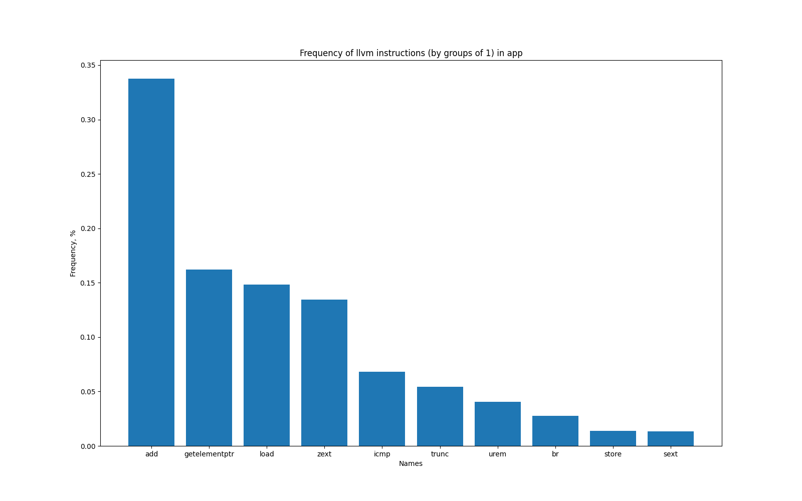
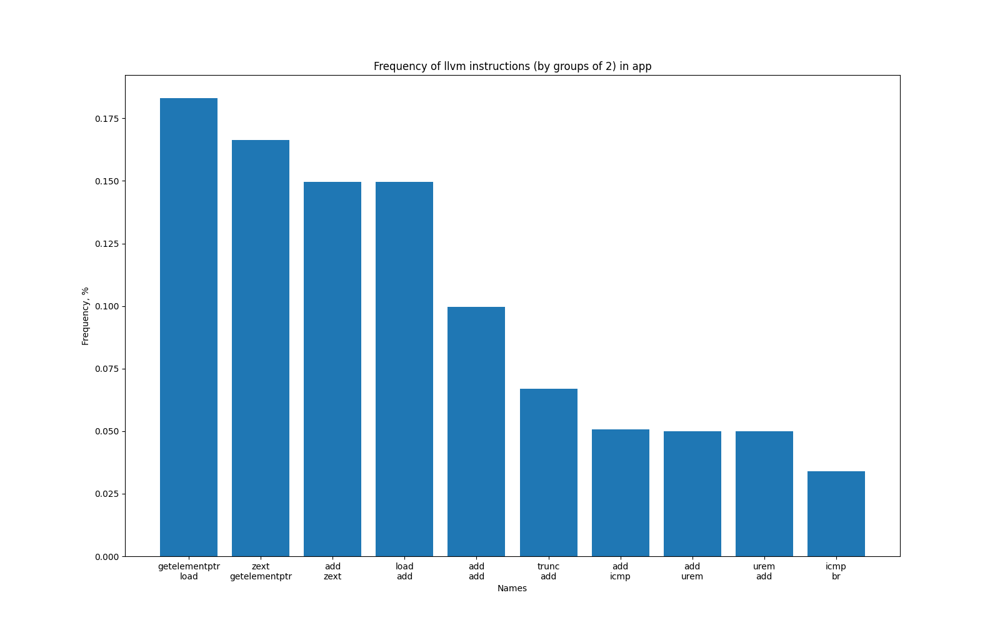
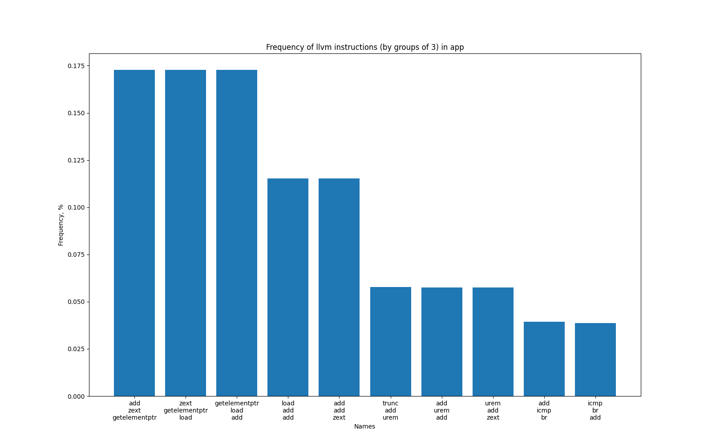
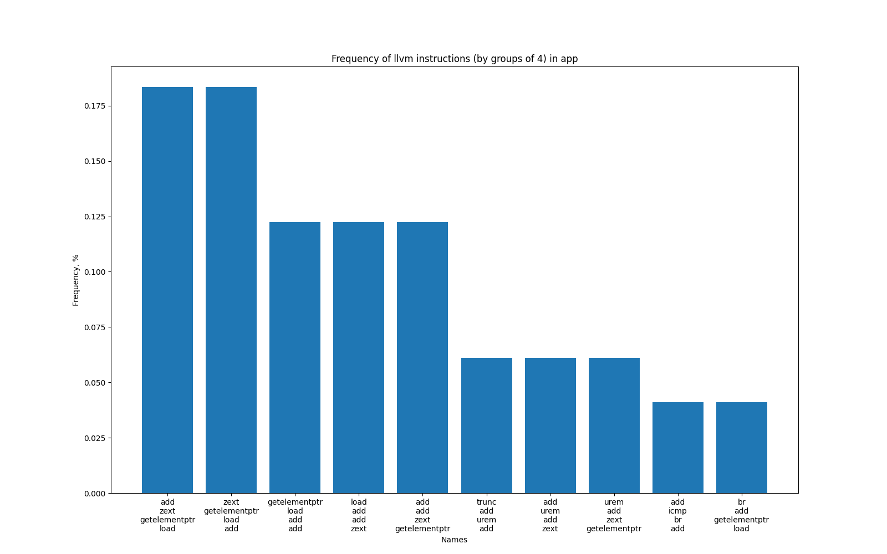
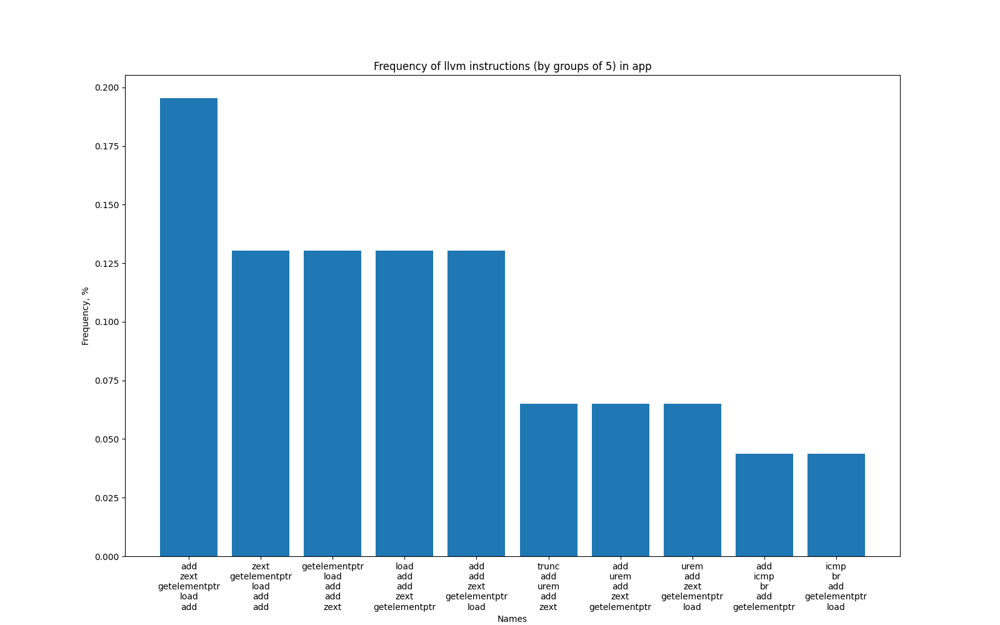

# CompilerStudy
Repository for compiler course

[First task](#1st)

[Second task](#2nd)

[Third task](#3rd)

For project configuration execute these commands from this repo root:

`mkdir build && cd build`

`cmake ..`

## First task 
Implemented "Game Of Life" splitted into app library in src/api and src/main.c connected with calculation logic of the application

To run the "Game of Life" run target `run_app` (`make run_app`)

## Second task 
Attention!!! Use Makefile instead of Ninja because of broken dependencies in ninja tool at this part

To see logs in runtime just run target `run_managed_app` (`make run_managed_app`)

To collect patterns run target `run-get-log` (`make run-get-log`), to make plots with python script run target `run-get-statistics` (`make run-get-statistics`), but these proccess will be long

Here you can see plots with patterns which were detected after run app with libLogger.so pass

## Third task 
Implemented LLVM IR generator and got output similar like in main.ll

To get generated LLVM IR run target `get_llvm_app_ir` (`make get_llvm_app_ir`), to run interpreter run target `run_llvm_app` (`make run_llvm_app`)
